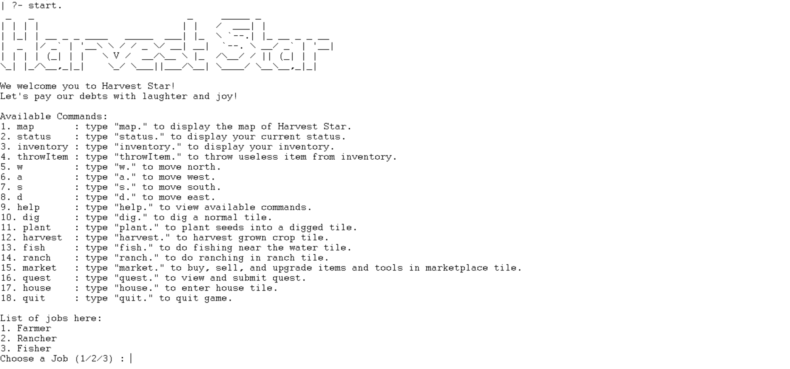
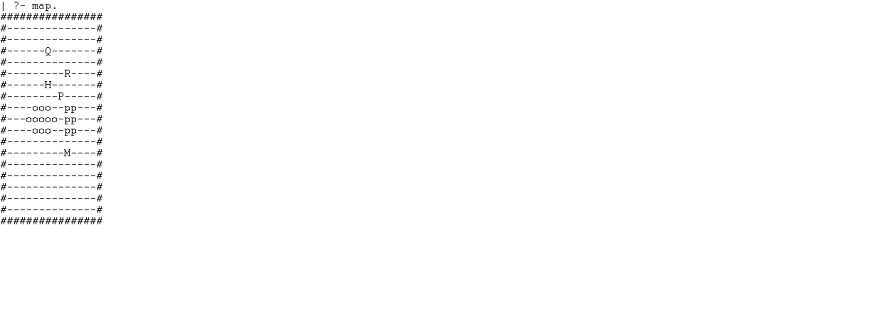
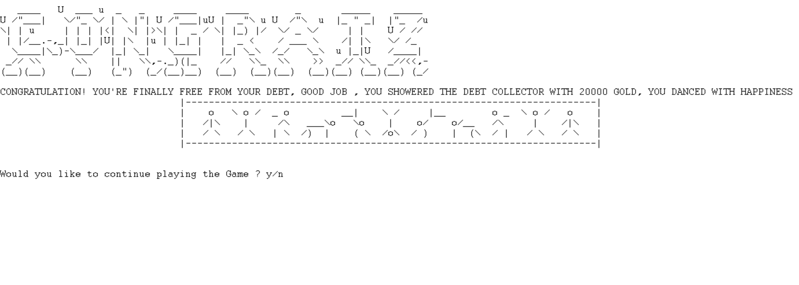

# Harvest Star
Tugas Besar IF2121 Logika Komputasional: I Got Scammed By My Client And Have to Restart My Life As A Farmer "A Farmer’s Life is Not That Bad, I Think"

## Table of Contents
* [General Information](#general-information)
* [Screenshots](#screenshots)
* [Structures](#structures)
* [Setup](#setup)
* [Usage](#usage)
* [Authors](#authors)

## General Information
Harvest Star merupakan farm simulator role-playing game yang dibuat menggunakan bahasa Prolog yang memiliki paradigma deklaratif. Untuk menyelesaikan permainan ini, pemain harus mencari 20.000 gold guna membayar hutang dalam jangka 1 tahun. Pemain bisa melakukan 3 kegiatan utama untuk mendapatkan gold, yaitu dengan fishing, farming, atau ranching.

## Screenshots
### Tampilan Start Game

### Tampilan Map

### Tampilan End Game


## Structures
```bash
C:.
│   README.md
│   
├───src
│       exploration.pl
│       farming.pl
│       fishing.pl
│       house.pl
│       inventory.pl
│       items.pl
│       main.pl
│       map.pl
│       market.pl
│       player.pl
│       quest.pl
│       ranching.pl
│       randomevent.pl
│       season.pl
│       weather.pl
│
└───test
        1.png
        2.png
        3.png
```

## Setup

## Usage

## Authors